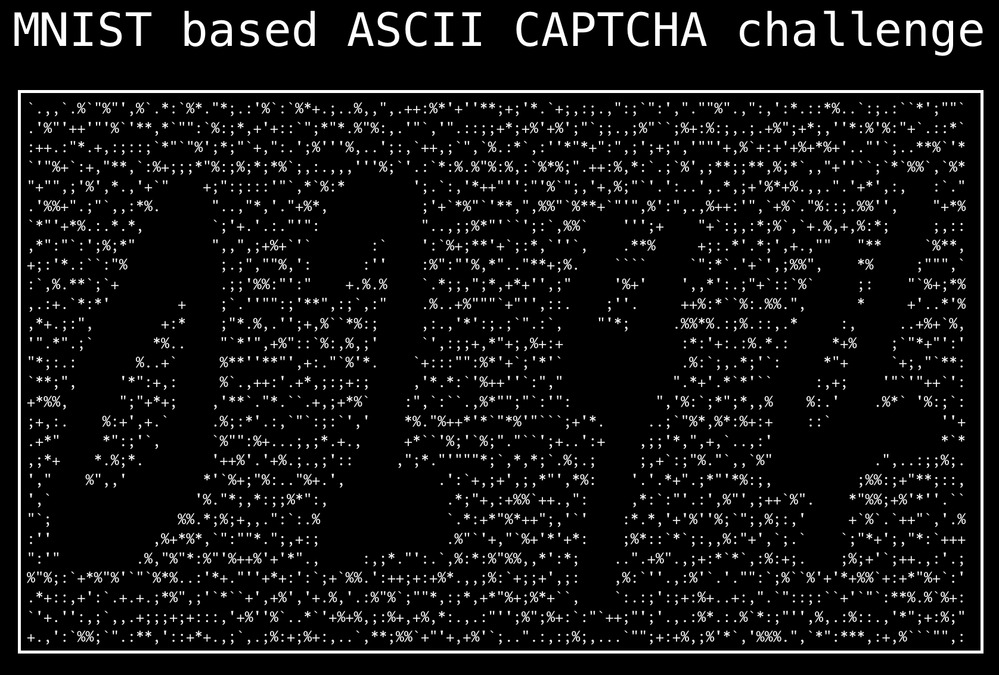
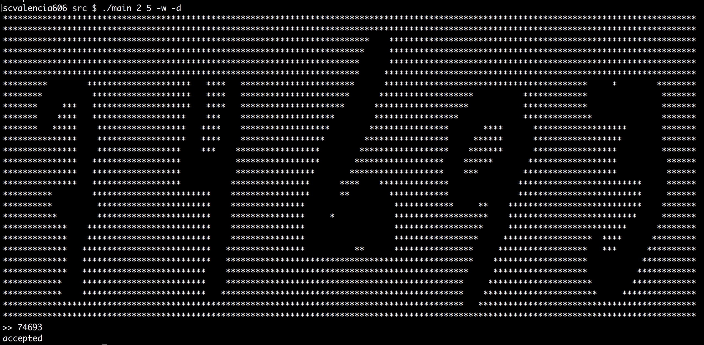
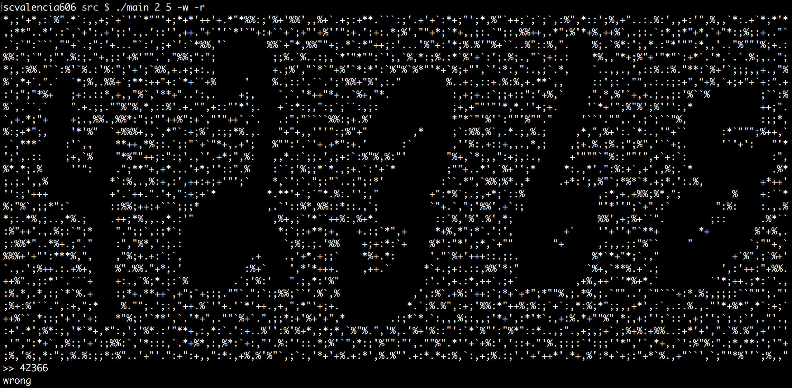
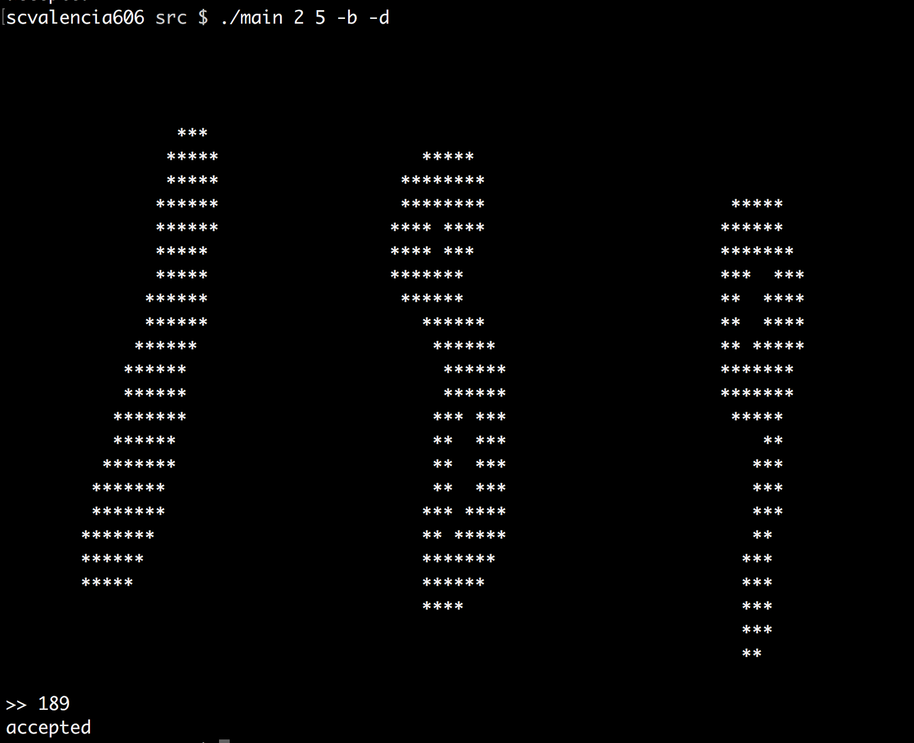
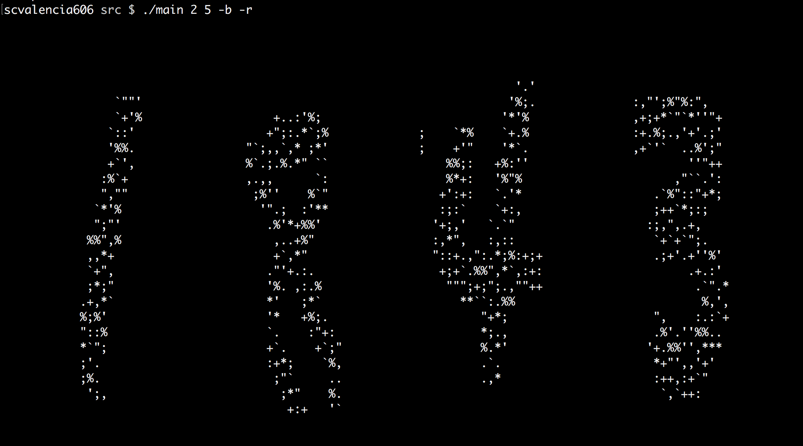

A beginner programmer has protected his computer terminal from malicious bots using a CAPTCHA (Completely Automated Public Turing test to tell Computers and Humans Apart) based authentication system that he wrote in `C`. To write the CAPTCHA he though it would be a great idea to use the MNIST data set as input for the system; he made use of the labeled data set to display a random number of ASCII formatted digits whose corresponding sequence is known (the program does knows `0244` is the answer, so if the user types this sequence it's not a bot). He is not aware of sophisticated hacks associated with the programming language of choice, and he doesn't know the existence of machine learning programs that can defeat his authentication program. You were hired as a penetration tester to defeat his program, he is pretty sure his system is robust and foolproof. You know you have two choices; to hack the program using ML methods or to use vulnerabilities in the program related to `The C Programming Language`.

The challenge is to provide a solution to this problem (hack the MNIST based ASCII CAPTCHA), by using any of the following methods:

* Computer hacking techniques related to the program itself, the properties of the program, or the computer memory while the program is running (the program holds explicit references to the correct sequence). You will need the source code (don't worry, it is short and clear).
* ML related methods. In this alternative, you will need the data set (`data/data.csv`), you do not need to know `C`, or to read the source code.

The program consists of a single `C` file (`src/main.c`), and you are not suppose to modify it. The attacks must come from other programs (a bot that gives you the correct sequence. The only input the bot can receive by hand is the ASCII banner printed by `main.c`). A description of the program follows:

To compile the program, just execute `make src/main`.

`./main min max [-w | -b] [-d | -r]` receives four command line arguments. 

1. The first pair (`min`, `max`) is the range for the selection of the length of the digits of the CAPTCHA. So the number of digits in the CAPTCHA can be any number between min and max inclusive.
2. `[-w | -b]` tells the program the way every single digit must be displayed in the terminal. If `-w` is selected, the digits must be filled by spaces and the remaining banner should be filled with ASCII characters (an special range of values that excludes the space character). Otherwise, if `-b` is selected, the digits must be filled and the remaining banner must consist of spaces.
3. `[-d | -r]` tells the program the character to fill the banner depending on the previous selection. If `-d` is selected, an special but unique character will fill the banner. If `-r` is selected, the banner would be filled by random characters.

### Some examples

1. `./main 2 5 -w -d`

2. `./main 2 5 -w -r`

3. `./main 2 5 -b -d`

4. `./main 2 5 -b -r`

### Solve the challenge

To solve the challenge, just fork the repository and write your solution. You'll learn a lot from it. `Happy Hacking`

